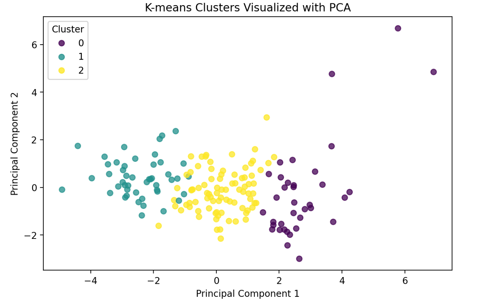
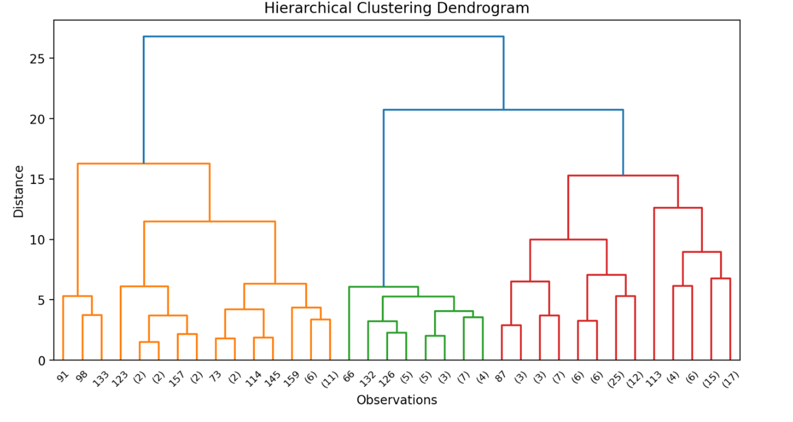
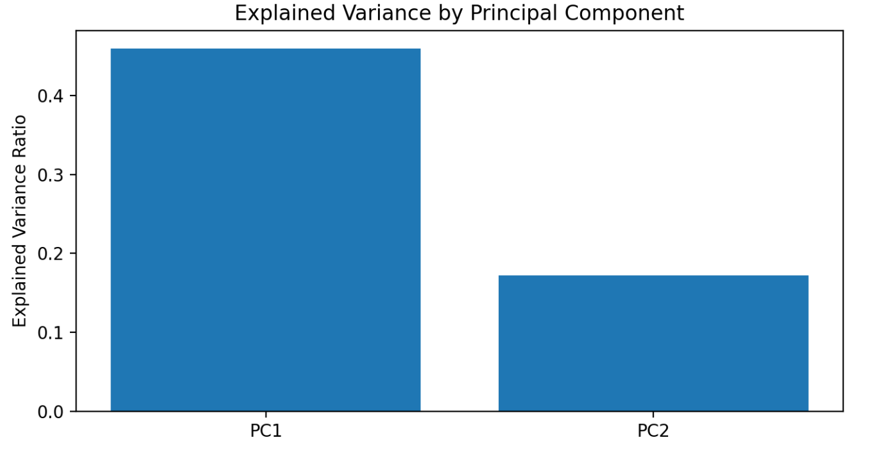

# Global Development Cluster Explorer

## Project Overview

The Global Development Cluster Explorer is an interactive Streamlit app that uses unsupervised machine learning to explore patterns in country-level development data.

Instead of predicting a target variable, this app helps users identify groups of countries with similar socioeconomic, health, demographic, and economic characteristics. Users can explore country similarity through K-means clustering, hierarchical clustering, and Principal Component Analysis (PCA).

The app includes a built-in country development dataset, but users can also upload their own CSV file and experiment with different variables and model settings.

## Deployed App

The live Streamlit app is available here:

https://bektas---data---science---portfolio-k3pmjwu6nte4tnfb8mywep.streamlit.app/

## App Screenshots

### K-Means Clustering Visualization

The app allows users to run K-Means clustering and visualize the resulting clusters in two dimensions using PCA. This helps users see how observations are grouped after clustering.



### Hierarchical Clustering Dendrogram

The hierarchical clustering section displays a dendrogram, which shows how observations are grouped together at different distance levels. Users can experiment with linkage methods to see how the clustering structure changes.



### PCA Explained Variance

The PCA section includes an explained variance chart, showing how much variation is captured by each principal component. This helps users understand how effectively the data can be reduced into fewer dimensions.



## App Features

Users can:

- Use the built-in country development dataset
- Upload their own CSV dataset
- Select numeric variables for analysis
- View non-numeric columns that are excluded from modeling
- Use one non-numeric column as an optional label
- Standardize numeric variables before modeling
- Run K-means clustering
- Run hierarchical clustering
- Explore Principal Component Analysis
- View PCA scatterplots
- View cluster counts
- View cluster profile tables
- View a hierarchical clustering dendrogram
- View explained variance and PCA loadings

## Dataset

The built-in dataset is `Country-data.csv`, which contains country-level development indicators.

| Variable | Description |
|---|---|
| `country` | Country name |
| `child_mort` | Child mortality rate |
| `exports` | Exports as a percentage of GDP |
| `health` | Health spending as a percentage of GDP |
| `imports` | Imports as a percentage of GDP |
| `income` | Net income per person |
| `inflation` | Annual inflation rate |
| `life_expec` | Average life expectancy |
| `total_fer` | Total fertility rate |
| `gdpp` | GDP per capita |

The `country` column is used only as an optional label. It is not used as a model input. The unsupervised models use the numeric development indicators.

## Data Requirements for Uploaded Files

Users can upload their own CSV file.

Uploaded datasets should contain at least two numeric columns. The app uses only numeric variables for clustering and PCA.

Non-numeric columns are excluded from model training. However, one non-numeric column can be selected as an optional label column. For example, a column containing country names, company names, school names, or observation IDs could be used to label points in the visualization.

If users want categorical variables included in the analysis, they should encode those variables before uploading the dataset.

For example, a categorical variable such as:

```text
Region: Europe, Africa, Asia
```

## References and Resources Used

This project was built using documentation and examples from the following resources:

- [Streamlit Documentation](https://docs.streamlit.io/) — used for building the interactive app interface, including file uploads, sidebar controls, and displaying charts.
- [scikit-learn Documentation](https://scikit-learn.org/stable/) — used for implementing K-Means clustering, hierarchical clustering, PCA, preprocessing, and evaluation metrics.
- [Pandas Documentation](https://pandas.pydata.org/docs/) — used for loading, cleaning, and preparing tabular datasets.
- [Matplotlib Documentation](https://matplotlib.org/stable/index.html) — used for generating visualizations such as clustering plots and explained variance charts.
- [SciPy Hierarchical Clustering Documentation](https://docs.scipy.org/doc/scipy/reference/cluster.hierarchy.html) — used as a reference for dendrograms and hierarchical clustering visualizations.
